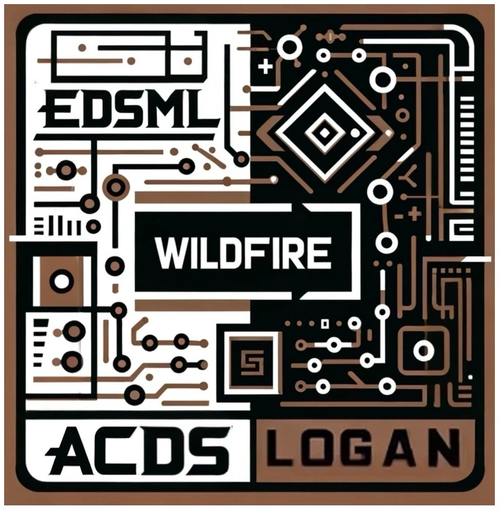

# ACDS Wildfire Project - Team Logan


## Project Overview
The goal of this project is to develop  a comprehensive  system that predicts a wildfire behavior using Recurrent Neural  Networks (RNN), Generative  AI, and data assimilation techniques.  This system will use historical wildfire data, and satellite imagery feeds, to enhance  prediction accuracy 
and provide actionable insights. For a full project brief please see the [project briefing presentation](./objectives.pdf). 

## Datasets
The datasets used in this project were provided with the project brief and can be split into model data and satellite data. The data refers to the [Ferguson fire](https://en.wikipedia.org/wiki/Ferguson_Fire) which occured in California, USA during July 2018. All datasets were pre-processed prior to this project and can be accessed using the links below. Alternatively, these datasets are automatically downloaded when users are running task1 and task3 Clean notebooks (with command download.download_file() command). 

| Dataset  | Notes                                                |
|----------|------------------------------------------------------|
| [Training data](https://imperiallondon-my.sharepoint.com/personal/rarcucci_ic_ac_uk/_layouts/15/onedrive.aspx?id=%2Fpersonal%2Frarcucci%5Fic%5Fac%5Fuk%2FDocuments%2FBigData%2Ddata%2Dassessment%2FFerguson%5Ffire%5Ftrain%2Ezip&parent=%2Fpersonal%2Frarcucci%5Fic%5Fac%5Fuk%2FDocuments%2FBigData%2Ddata%2Dassessment&ga=1) | Training data obtained from wildfires simulation |
| [Testing data](https://imperiallondon-my.sharepoint.com/personal/rarcucci_ic_ac_uk/_layouts/15/onedrive.aspx?id=%2Fpersonal%2Frarcucci%5Fic%5Fac%5Fuk%2FDocuments%2FBigData%2Ddata%2Dassessment%2FFerguson%5Ffire%5Ftest%2Ezip&parent=%2Fpersonal%2Frarcucci%5Fic%5Fac%5Fuk%2FDocuments%2FBigData%2Ddata%2Dassessment&ga=1) | Similar to training data but obtained from different simulations |
| [Background data](https://imperiallondon-my.sharepoint.com/personal/rarcucci_ic_ac_uk/_layouts/15/onedrive.aspx?id=%2Fpersonal%2Frarcucci%5Fic%5Fac%5Fuk%2FDocuments%2FBigData%2Ddata%2Dassessment%2FFerguson%5Ffire%5Fbackground%2Ezip&parent=%2Fpersonal%2Frarcucci%5Fic%5Fac%5Fuk%2FDocuments%2FBigData%2Ddata%2Dassessment&ga=1) | Model data to be used for assimilation |
| [Observation data](https://imperiallondon-my.sharepoint.com/personal/rarcucci_ic_ac_uk/_layouts/15/onedrive.aspx?id=%2Fpersonal%2Frarcucci%5Fic%5Fac%5Fuk%2FDocuments%2FBigData%2Ddata%2Dassessment%2FFerguson%5Ffire%5Fobs%2Enpy&parent=%2Fpersonal%2Frarcucci%5Fic%5Fac%5Fuk%2FDocuments%2FBigData%2Ddata%2Dassessment&ga=1) | Satellite data at different days after ignition (only one trajectory) |

## Code Structure
The repository is organised into the following structure:
```
acds-wildfire-logan
.
├── Task_Notebooks
│   ├── Task1.ipynb
│   ├── Task2.ipynb
│   └── Task3.ipynb
├── Exploration_Notebook
│   ├── Task1_Exploration.ipynb
│   ├── Task2_ConvVAE_timestep2.ipynb
│   ├── Task2_GAN128.ipynb
│   ├── Task2_GAN64.ipynb
│   ├── Task2_LinearVAE.ipynb
│   ├── Task2_NewGan.ipynb
│   ├── Task2_VAE_pipeline.ipynb
│   ├── Task3_Exploration.ipynb
│   └── Task3_PCA.ipynb
├── LICENSE
├── README.md
├── WildfireLogan
│   ├── __init__.py
│   ├── assimilation
│   │   ├── KF
│   │   ├── __init__.py
│   │   ├── model
│   │   └── predicting
│   ├── convLSTM
│   │   ├── __init__.py
│   │   ├── dataset
│   │   ├── evaluating
│   │   ├── model
│   │   ├── predicting
│   │   ├── training
│   │   └── utils
│   ├── download
│   │   ├── __init__.py
│   │   └── download.py
│   └── fergusonfire
│       ├── __init__.py
│       ├── dataset
│       ├── generate
│       ├── model
│       ├── training
│       └── utils
├── objectives.pdf
├── requirements.txt
├── setup.py
├── structure.txt
└── tests
    ├── __init__.py
    ├── test_assimilation.py
    ├── test_cae.py
    ├── test_dataset.py
    ├── test_indexing.py
    ├── test_model.py
    ├── test_mse.py
    ├── test_plotting.py
    ├── test_predicting.py
    ├── test_training.py
    └── test_utils.py

```

## Setup
To set up the project, ensure the following steps are followed:

### Step 1: Clone the Project

```bash
git clone https://github.com/ese-msc-2023/acds3-wildfire-logan.git
cd acds3-wildfire-logan/
```

#### Step 2: Install WildfireLogan Package

```bash
pip install -e .
```

#### Step 3: (optional) Verify installation
After installing the dependencies, verify the installation by running pytest in project top level directory
```
pytest
```

#### Step 3: Run Clean Notebooks: Task1.ipynb, Task2.ipynb and Task3.ipynb
1. Navigate to the `Task_Notebooks`
2. Open notebook
3. Select the kernel you've installed WildfireLogan package and run

#### Noticable Points

- Users running the Clean notebooks do not need to execute the 'if working on Colab' cells once the WildfireLogan Package has been installed in the local environment, as instructed in the previous 'Running the Project' section.
- If users prefer to directly run the Clean notebooks, they can skip the 'Running the Project' section above and proceed directly to the 'if working on Colab' cells in the Clean notebooks.
- In the Task1 and Task3 Clean notebooks, training the neural network model is not necessary. Users can simply load a pre-trained model as guided in the notebook.

## System Requirements
Check the requirements.txt file to know about the required packages for the project

## Package User Guide
Open: Documentation_html/build/html/index.html

## Authors
* Shrreya Behll
* Yibing Chen
* Hongxuan Jiang
* Peiyi Leng
* Yixin Li
* Sarah Nesti
* Aoife Robertson
* Robert Smith

## License
MIT License

## References
Kramer, M.A. (1991). Nonlinear principal component analysis using autoassociative neural networks. AIChE Journal, 37(2), pp.233–243. doi:https://doi.org/10.1002/aic.690370209.

Olah, C. (2015). Understanding LSTM Networks. [online] Github.io. Available at: https://colah.github.io/posts/2015-08-Understanding-LSTMs/.

S. Cheng, Y. Guo and R. Arcucci, "A Generative Model for Surrogates of Spatial-Temporal Wildfire Nowcasting," in IEEE Transactions on Emerging Topics in Computational Intelligence, vol. 7, no. 5, pp. 1420-1430, Oct. 2023, doi: 10.1109/TETCI.2023.3298535.